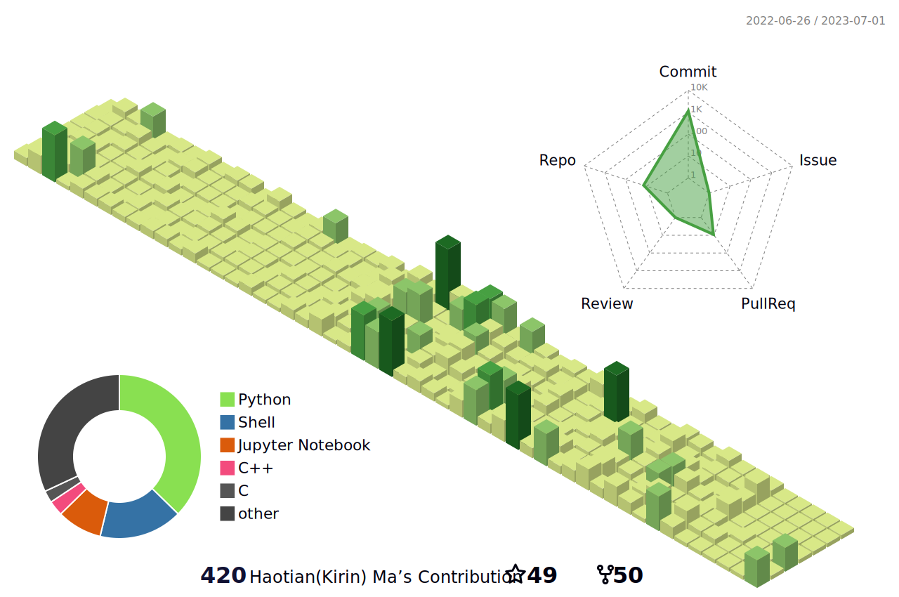

<h1 align="center">:wave: Hi , I'm Haotian (Kirin) MA  </h1>


<div  align="center">    

[](https://www.linkedin.com/in/htma/) 
[](https://twitter.com/mahaotian10) 
<a href="https://github.com/TSdreamer/TSdreamer/blob/main/Haotian (Kirin) Ma_2023.07.pdf" target="blank"></a> 
<a href="mailto:HaotianTeemo@outlook.com" target="blank"></a> 
</div>


<div style="display: flex; justify-content: space-between; align-items: flex-end;">
  
   
</div>

- I'm a passionate **Ph.D. Candidate** in **Engineering**, specializing in **Machine Learning**, **Energy Modelling**, and **Hydrogen Production Simulation**.

## 🔬 Research Focus

- Sustainable Energy Engineering
- Renewable Hydrogen Production
- Machine Learning
- System Modelling
- Process Simulation
- Electrochemistry Modelling
  
## 🔧 Skills
- **Languages:** C/C++, Python, OCAML
- **Frameworks:** React, Node.js, Express.js, Django,KIVY
- **Databases:** MongoDB, MySQL, PostgreSQL
- **Tools:** Git, Docker, VS Code, Jupyter Notebook
- **Software:** COMSOL, Aspen, gProms, CFD 
- **Experiment:** XRD, SEM, TEM, and other Material Characterisation Experiments
  
## :man_student: Education Background

- **Ph.D. in Engineering** (Expected 2026)  
  University of Warwick(UoW), Coventry, United Kingdom

- **Research Assistant in Computer Science and Chemical Engineering** (2022)  
  University of Birmingham, Birmingham, United Kingdom

- **Master of Science in Sustainable Energy Engineering** (2021)  
  University of Nottingham, Nottingham, United Kingdom
  
- **Bachelor of Engineering** (2019)  
  Southeast University, JiangSu, China 


## :man_judge: Working Experience

- **Warwick Manufacturing Group**      
  Research Assistant, Coventry, United Kingdom

- **Global Energy Interconnection Research Institute**   
  Energy Research Project Manager, Berlin, German

- **HUAWEI Nuremberg Research Center**   
  Energy Research Project Manager, Nuremberg, German
  
- **XPeng Europe**    
  Business Analyst, Amsterdam, Netherlands

## 🌐 Personal Description

- Here on **GitHub** you can find research projects as well as open-source software developed in my spare time.

- Currently, my **open-source-projects** attract    </p>


<p align="center">
    <div style="display: flex; justify-content: center;">

 <a href="https://github.com/TSdreamer">
    
 </a>
  <a href="https://github.com/TSdreamer">
    
  </a>
  <a href="https://github.com/TSdreamer">
    
 </a>
    </div>
</p>


## :trophy: Highlighted Repositories
[]( https://github.com/TSdreamer/Machine_Learning_MEA_Optimization)
[](https://github.com/TSdreamer/Gradient-Boosting-Tree)
[](https://github.com/TSdreamer/awesome-machine-learning)
[](https://github.com/TS-energy/Simscape-Battery-Library)


<!-- Belarus - My Home-->
  
 ```geojson
{
  "type": "FeatureCollection",
  "features": [
    {
      "type": "Feature",
      "properties": {
        "City": "Beijing"
      },
      "geometry": {
        "type": "Point",
        "coordinates": [116.4074, 39.9042]
      }
    },
    {
      "type": "Feature",
      "properties": {
        "City": "Shanghai"
      },
      "geometry": {
        "type": "Point",
        "coordinates": [121.4737, 31.2304]
      }
    },
    {
      "type": "Feature",
      "properties": {
        "City": "London"
      },
      "geometry": {
        "type": "Point",
        "coordinates": [0.1276,51.5072]

      }
    },
    {
      "type": "Feature",
      "properties": {
        "City": "Shenzhen"
      },
      "geometry": {
        "type": "Point",
        "coordinates": [114.0579, 22.5431]
      }
    },
    {
      "type": "Feature",
      "properties": {
        "City": "Xi'an"
      },
      "geometry": {
        "type": "Point",
        "coordinates": [108.9398, 34.3416]
      }
    },
   {
    "type": "Feature",
    "properties": {
      "City": "Hangzhou"
    },
    "geometry": {
      "type": "Point",
      "coordinates": [120.1536, 30.2875]
    }
  }

  ]
}


```


<!--   profile-green-animate -->


